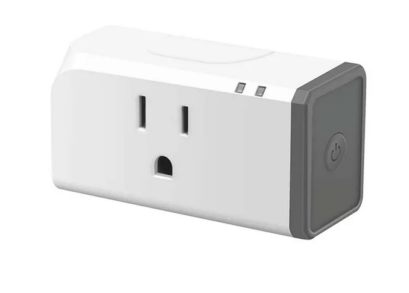

---
# Metadata
title: 'ButtonQ'
type: 'Prototyping + Electronics'

# Thumbnails
thumbnail: './thumbnail.svg'

# Options
path: '/buttonq/'
order: 2
---

<article role="article">

The ButtonQ was a project I built while I was working at TechTAP Inc. It was a product designed to help load balance cashier checkout queues at larger businesses.

<article role="article">

</article>

ButtonQ is wifi-connected button and a screen that showed advertisements to customers waiting in line to checkout. Whenever a cashier became available they could press their _button_ and the screen would flash the number of the available checkout aisle to _queue_ the next customer.

TechTAP sold the system to a supplier of grocery store lighting solutions down in Nashville.

</article>

<article role="article">

<iframe width="560" height="315" src="https://www.youtube.com/embed/B_Y43Y9PY2o" title="YouTube video player" frameborder="0" allow="accelerometer; autoplay; clipboard-write; encrypted-media; gyroscope; picture-in-picture" allowfullscreen></iframe>

</article>

<article role="article">

I got involved with the project from someone emailing the hacklab mailing board. They were looking for a way to toggle power on a light that ran on mains power. I responded back, keen to cut my teeth on my very first electronics contract job! It also seemed the perfect opportunity to test out the ESP8266, a WiFi capable microcontroller I had heard about at hacklab but never used myself.

Over a weekend myself and a TechTAP employee ( @exluto ) put together a proof of concept of the ButtonQ at Hacklab.TO!

</article>

<article role="article">

<iframe width="560" height="315" src="https://www.youtube.com/embed/_PzrbdlmDW8" title="YouTube video player" frameborder="0" allow="accelerometer; autoplay; clipboard-write; encrypted-media; gyroscope; picture-in-picture" allowfullscreen></iframe>

</article>

<article role="article">

After building this proof of concept, TechTAP hired me on fulltime to complete the project.

I had 2 months from getting hired to put together a prototype to ship to the client. The client's ask was 8 buttons that could turn mains power on/off and trigger a notice on a digital signage screen.

The design brief was well defined, but we were under high time constraints.

</article>

<article role="article">

</article>

<article role="article">

We used off the shelf parts for everything.

The button was an arcade button hooked to an esp8266 NodeMCU devboard and mounted on a PVC project case we bought off amazon.

The mains power relay was tricky to do safely, but I found a [Controllable Four Outlet Power Relay Modules](https://www.adafruit.com/product/2935) from McMaster-Carr.

</article>

<article role="article">

</article>

<article role="article">

Another developer at TechTAP found [PiSignage](https://github.com/colloqi/piSignage), an opensource digital signage program designed for the raspberry pi. Digging into it's source code, they discovered a way to build a simple Android app that would recieve signage content from PiSignage.

Picking up from where their work left off, I architected a system which used the raspberry pi as a digital signage server and MQTT server, and a fleet of esp8266's communicating to eachother and the pi over MQTT.

</article>

<article role="article">

</article>

<article role="article">

</article>

<article role="article">

I wrote firmware for the buttons and relays using HTTP, WiFi, and MQTT libraries for the esp8266. The buttons published to MQTT topics that the relays were subscibed to. When one of a button's switches changed state the event would get published and routed by the RaspberryPi to that button's paired relay.

For the Pi I wrote a simple python script that listened for all the events published by the esp8266s. Whenever one of the buttons were pressed, the python script would send a request over socketio to the custom android app that had been made by the other TechTAP developer. I used systemd unit files to handle starting all required services on system boot.

For networking I used a cheap OpenWRT router.

</article>

<article role="article">

</article>

<article role="article">

We were able to hit our 2 month deadline! Though it took a few very long days of testing and last minute changes in the office and some rushed weekend shipping. The client was thrilled with the prototype and was ready rehire us for another round of revisions.

They wanted the relay to be smaller and the button to look more unique. We had another 2 month turn around.

</article>

<article role="article">

</article>

<article role="article">

Instead of using off the shelf parts, this time I opted for off the shelf products.

With some research a coworker and I found a seller on AliExpress selling jumbo buttons that came with an esp8266 and a WS2812B RGB LED already inside. The seller, [APRBrother](https://blog.aprbrother.com/product/abutton-v3), provided [schematics and documentation for their button](https://wiki.aprbrother.com), and an FTDI programmer!

<article role="article">

</article>

<article role="article">

The APRBrother button required a couple of modifications to meet the design spec of our client.

The client had asked for a clicky momentary button, an on/off switch, and for the button to be able to run on USB power. APRBrother's button, however, had a spongy and soft feel to it's momentary button, no on/off switch, and ran on 2 AA batteries.

To satisfy the clients requirements I used a small fleet of 3d printers at the Toronto Tool Library Makerspace to make an case that would fit around APRBrother's button.

</article>

<article role="article">

</article>

<article role="article">

The Home Hardware at College and Spadina has an electronics section in their basement. Luckily I was able to find a clicky momentary switch that was the same size standard as the one in APRBrother's button!

Finally, I enlisted (and paid for) the help of my friend Rana to do the slow work of replacing the button's momentary buttons, adding an on/off switch, and (regretfully) soldering the FTDI programmers to the buttons to provide a usb interface for power.

</article>

<article role="article">

</article>

<article role="article">

After a very long night of soldering, and 3 coats of boring-corporate-grey spray paint, the buttons were done!

</article>

<article role="article">

</article>

<article role="article">

I used a SONOFF S31 for the relay.

</article>

<article role="article">

</article>

<article role="article">

SONOFF brand items smart home devices that are ESP8266 based. Though ITEAD ships SONOFF products with a proprietary app for controlling and configuring them, they also leave serial pins accessible on their products' PCBs. Which meant I could write my own firmware for them!

</article>

<article role="article">

</article>

<article role="article">

Using the FTDI-USB programmer that we got with our AliExpress ESP8266 buttons I was able to program the esp8266 devices! I even tried making a jig to program them faster in batches! (The jig worked, but not reliably enough to make it worth fiddling with rather than )

</article>

<article role="article">

</article>

<article role="article">

More late nights of flashing, testing, and fixing followed while we tried to meet our 2 month deadline. With the support of my coworkers a ButtonQ set of 8 buttons was prepared and shipped to our client.

</article>

<article role="article">

</article>

<article role="article">

TechTAP was contracted for a third iteration of the ButtonQ button. The clients ask this time was a flatter, smaller button. Something simple and cylindrical.

I created a 3 printed button case that was fully parametric! That way we could easily create different sizes to the client's taste.

</article>

<article role="article">

</article>

<article role="article">

I switched jobs shortly after starting the third iteration of the ButtonQ project and never saw it to completion.

This project was an exercise in self learning. My coworkers at TechTAP were hugely supportive in the completion of each iteration of this project. But I was most often on my own for solving the technical challenges required to realize this project. CAD and 3D printing were areas I had only dabbled in before this project. I was still quite new to electronics and firmware development. I also learned way more about networking and Linux system administration! Through the development of ButtonQ I became proficient enough to ship a product to a client (twice!) that relied on all of these skills!

> It was bittersweet to leave a position where I got so much creative freedom in to how realize a solution for such a simple design brief.

</article>
