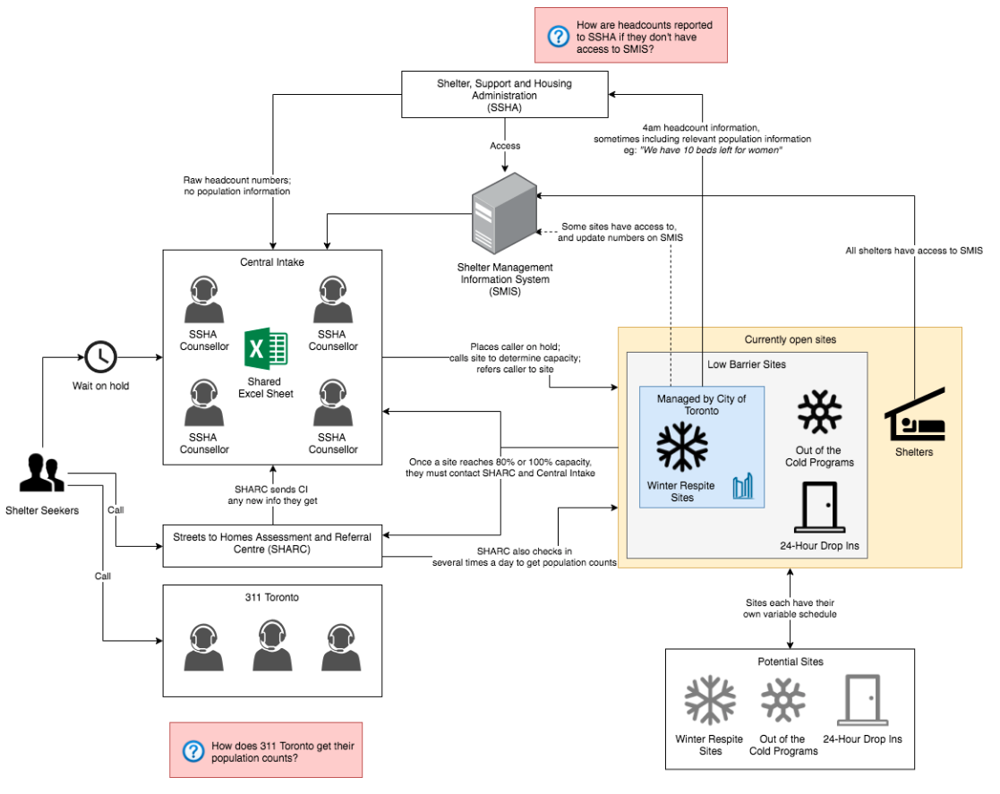

---
# Metadata
title: 'Basecount'
type: 'Research + Web Development'

# Thumbnails
thumbnail: './thumbnail.svg'

# Options
path: '/basecount/'
order: 4
---

<article role="article">

In the winter of 2017/18 shelter referral services were making news. There had been a string in incorrect information passed to the referral services; Clients started getting sent to shelters that were already at capacity, and some shelters were mostly empty.

That Janurary I joined an open source project at [Civic Tech Toronto](https://civictech.ca/) to tackle the way shelter referrals were handled in Toronto.

</article>

<article role="article">

Our team visited shelter staff around Toronto to try and understand what their experience was like when they had to update referral services on capacity.

Our Research showed that Toronto's referral services were mostly relying on phone conversations for their data. There was a digital occupancy management software that shelters had to track and publish this data, but it was too clunky to update it live. Most shelters updated it just once per night, just to record whether they had hit capacity or not.

<article role="article">

diagram by Andrew Carreiro and team Basecount

</article>

So our team started development of a mobile friendly webapp where shelter staff could log in to their shelter's account and publish what their live capacity was.

My contribution to the project was to help with shelter interviews. At the time this project was getting started I was in the thick of running [Chalmers Cards](/chalmerscards), producing 20-40 booklets per week. Since I already had relationships with staff at some of the shelters I was able to lend some expertise in the early stages of the project and

I also created this neat single page site for the project: https://basecount.netlify.app/

Once team Basecount an event in HackLab.TO where member of project Basecount led us through a design sprint. Over the course of 3 weekends we endeavoured to recreate the experience of a design sprint

<article role="article">

</article>

<article role="article">

<iframe loading="lazy" style="border: 1px solid rgba(0, 0, 0, 0.1);" src="https://www.figma.com/embed?embed_host=share&amp;url=https%3A%2F%2Fwww.figma.com%2Fproto%2Fdk4oQvyGyFsljLaKXSBwM9zC%2Fbasecount-wireframes%3Fnode-id%3D11%253A103%26viewport%3D664%252C1289%252C0.18000000715255737%26scaling%3Dscale-down&amp;chrome=DOCUMENTATION" allowfullscreen="" width="600" height="800"></iframe>

Basecount prototype created by [Vivian Ngai](https://www.byvivian.com/basecount/), [Joey Hua](https://joeyhua.com/), and team Basecount

</article>
