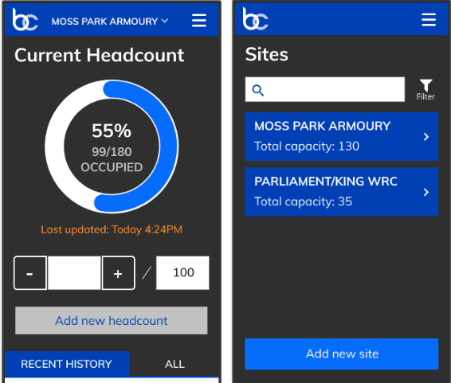

---
# Metadata
title: "Basecount"
type: "Research + Web Development"

# Thumbnails
thumbnail: "./thumbnail.svg"

# Options
path: "/basecount/"
order: 3
---

<article role="article">

In the winter of 2017/18 shelter referral services were making news. There had been a string in incorrect information passed to the referral services; Clients started getting sent to shelters that were already at capacity, and some shelters were mostly empty.

That Janurary I joined an open source project at Civic Tech to tackle the way shelter referrals were handled in Toronto.

</article>

<article role="article">

Our team visited shelter staff around Toronto to try and understand what their experience was like when they had to update referral services on capacity.

Our Research showed that Toronto's referral services were mostly relying on phone conversations for their data. There was a digital occupancy management software that shelters had to track and publish this data, but it was too clunky to update it live. Most shelters updated it just once per night, just to record whether they had hit capacity or not.  

So our team started development of a mobile friendly webapp where shelter staff could log in to their shelter's account and publish what their live capacity was.

</article>

<article role="article">

A few days ago we printed it up at [Hacklab.to](Hacklab.to). We're going to try and make a mold out of the model, and then try to cast a first silicone prototype in it.

</article>

