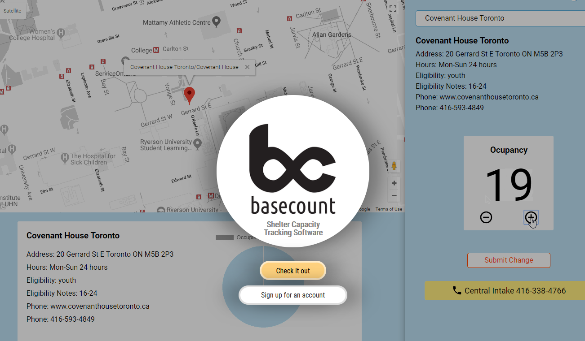
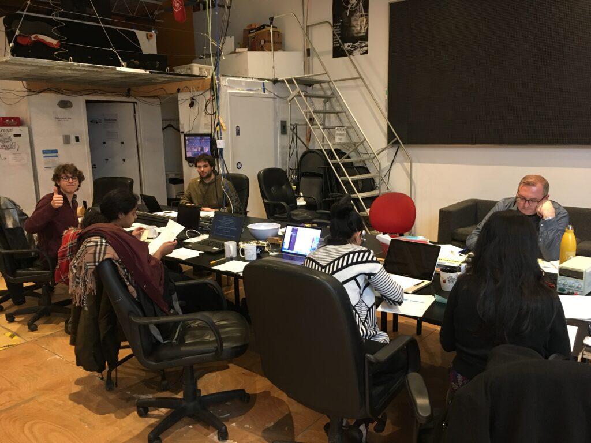
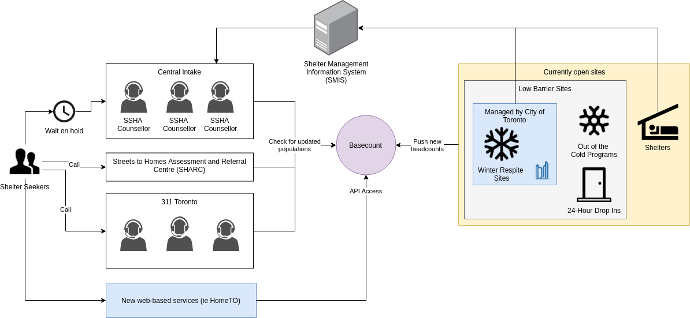

---
# Metadata
title: 'Basecount'
type: 'Research + Web Development'

# Thumbnails
thumbnail: './thumbnail.svg'

# Options
path: '/basecount/'
order: 4
---

<article role="article">

In the winter of 2017/18 shelter referral services were making news. There had been a string in incorrect information passed to the referral services; Clients started getting sent to shelters that were already at capacity, and some shelters were mostly empty.

That Janurary I joined an open source project at [Civic Tech Toronto](https://civictech.ca/) to tackle the way shelter referrals were handled in Toronto.

</article>

<article role="article">

Winter 2017 was especially harsh. Toronto’s shelter infrastructure was struggling under an ever increasing load. Then people started dying. TPH reported ~2 homeless deaths per week on average for 2017. This number got higher in winter as people died from exposure to the cold and as shelters got more crowded. Things got so bad that the [Toronto Ombudsman lead an inquiry into the Shelter Administration](https://www.ombudsmantoronto.ca/OmbudsmanToronto/media/Documents/Enquiry%20Reports/Enquiry-into-City-Winter-Respite-Services-2017-18.pdf?ext=.pdf). Around Janurary [news reports](https://www.cbc.ca/news/canada/toronto/toronto-ombudsman-investigates-homeless-shelters-1.4470393) start coming in about shelters failing to properly load balance the populations. Some shelters were over capacity while some were barely used. This was later confirmed in the Ombudsman report.

Meanwhile the members of basecount were reaching out to shelters across Toronto for interviews. We were learning about how intake of clients happen, how referrals are made, how their occupancy data is generated and where it gets published. Notes from those interviews are still available on our public [google drive](https://drive.google.com/drive/folders/17e4itEeCtnGaii_MywHChIc6-C3DSKwK).

Our Research showed that Toronto's referral services were mostly relying on phone conversations for their data. There was a digital occupancy management software that shelters had to track and publish this data, but it was too clunky to update it live. Most shelters updated it just once per night, just to record whether they had hit capacity or not.

At the time City shelters were using a combination of SMIS and and an Excel spreadsheet (literally one spreadsheet on one computer in a central office) to monitor shelter occupancy and refferals. SMIS was (and still is) a large clunky desktop software full of long lists and ugly, difficult to use interface. There's a mandatory 4 hour training course for it. And staff that we had talked to really didn't like it. It's probably the reason shelter occupancy data was only being updated once per night.

<article role="article">

diagram by Andrew Carreiro and team Basecount

</article>

My contribution to the project was to help with shelter interviews. At the time this project was getting started I was in the thick of running [Chalmers Cards](/chalmerscards), producing 20-40 booklets per week. Since I already had relationships with staff at some of the shelters I was able to lend some expertise in the early stages of the project and provide connections for Basecount team members to get interviews.

I also created this neat single page site for the project: https://basecount.netlify.app/

</article>

<article role="article">

</article>

<article role="article">

After conducting research interviews with shelter reception staff, we planned a design sprint to help define the MVP of the product we would build.

I helped organize to hold an event at [Hacklab.to](https://www.hacklab.to) where members of Basecount led us through a design sprint.

</article>

<article role="article">

</article>

<article role="article">

We decided on an occupancy reporting mobile app with some management features. Shelter managers would be able to create organizations within our app and add their staff members to it. They would be able to manage their occupancy and bed availability through an intuitive GUI while simultaneously publishing their availability to other shelters for referrals.

We got to designing and coding. We had a team of ~3 designers and ~4 coders. The app was designed mostly in Figma and was built on Ruby-on-Rails with a React frontend. Through summer 2018 and into fall we designed and coded and worked our butts off. I supported development by making pull requests against Basecounts evolving application's frontend on Github. It was my first time cutting my teeth on React!

Around this time we also started talking with [AmpleLabs](https://www.amplelabs.co) about sharing data our app produced with their chatbot (then called the HomeTO chatbot). Dilini, from AmpleLabs, joined our team to help with our communications to shelter and city staff.

We kept contact with the shelter staff we had interviewed with and started demo'ing the app around early fall. Also in early fall one of our members, Dilini, started reaching out to the shelter administration, SSHA, for a meeting and a demo.

Embedded below is a mockup made by Basecount members of what the webapp would have looked like.

</article>

<article role="article">

<iframe loading="lazy" style="border: 1px solid rgba(0, 0, 0, 0.1);" src="https://www.figma.com/embed?embed_host=share&amp;url=https%3A%2F%2Fwww.figma.com%2Fproto%2Fdk4oQvyGyFsljLaKXSBwM9zC%2Fbasecount-wireframes%3Fnode-id%3D11%253A103%26viewport%3D664%252C1289%252C0.18000000715255737%26scaling%3Dscale-down&amp;chrome=DOCUMENTATION" allowfullscreen="" width="600" height="800"></iframe>

Basecount prototype created by [Vivian Ngai](https://www.byvivian.com/basecount/), [Joey Hua](https://joeyhua.com/), and team Basecount

</article>

<article role="article">

As the days got colder the dev team worked harder. Andrew Carreiro and Filip Stepien, Basecounts lead developers, put in particularly long hours.

In Nov 2018, after two months of attempted contact, Basecount got an email response from Toronto's Shelter Support and Housing Administration (SSHA). Unfortunately, the response we got from the city was that SSHA was uninterested in our project. Even if we deployed our project on our own, they said, SSHA was developing a similar project that was also designed to help load balance Toronto's shelters.

We felt we had done great research and produced a quality product. To find out that the City was developing something that would make our project obsolete, and that they weren't even interested in our research, was pretty crushing. We were in the middle of finishing the last chunk of the project, working through a tight crunch. Most of our core members quit the project. By the end of 2018 it was just me.

I was producing a lot of [Chalmers Cards](https://chalmerscards.com/chalmerscards) in Winter 2018/2019, so I was still going around to shelters and talking with the staff. Nobody knew of any new update to SMIS or any other software product from the City.

It wasn't until Fall 2019 I started to hear reports of an update to SMIS. This update displayed shelter occupancy availability in a single window. It was a single unordered list of all shetlers that couldn't be filtered. Women-only shelters were mixed with men-only shelters along with shelters for adults over 18+ and so on. Staff I talked to about it really disliked it.

2019 was also the year that what was left of Basecount morphed into the [Chalmers Signal](/chalmerssignal). I didn't have the full stack developer skills required to maintain BaseCount on my own, so I remade it as a hardware/IOT project!

</article>
