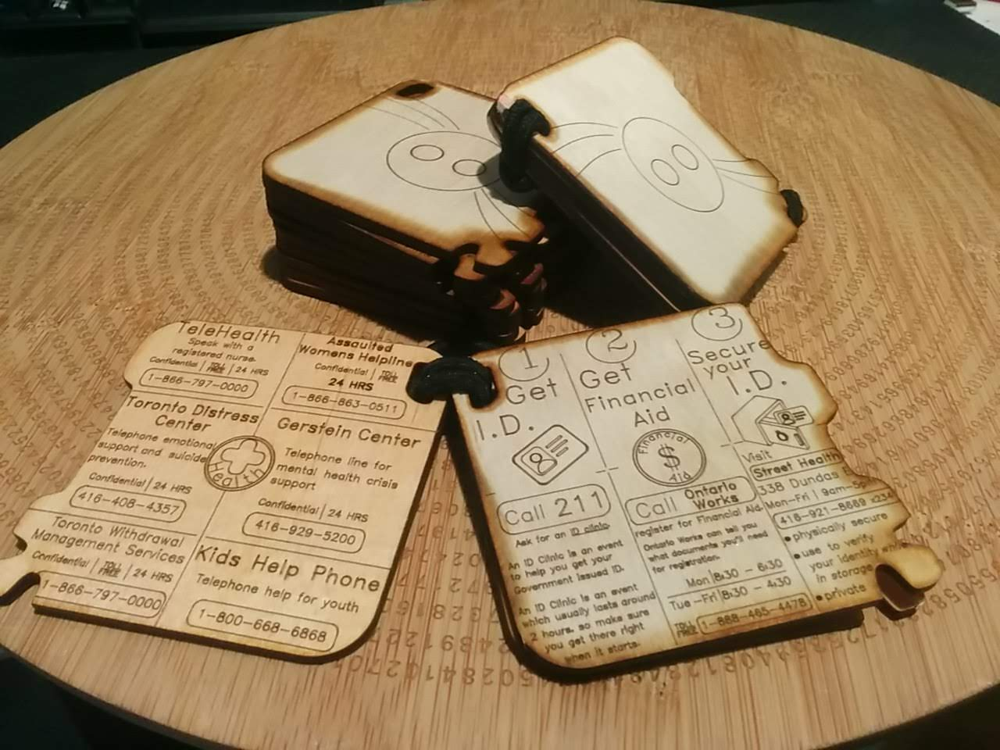

---
# Metadata
title: 'Chalmers Cards'
type: 'Research + Design'

# Thumbnails
thumbnail: './thumbnail.svg'

# Options
path: '/chalmerscards/'
order: 1
---

<article role="article">

Chalmers Cards are wooden information booklets that are designed to be given out at Toronto's emergency shelters and to folks sleeping on the streets of Toronto.

Chalmers Cards is the first [Chalmers Project](https://www.chalmerscards.com), a guerilla project that aims to improve the state of homlessness in Toronto.

**This article is in the same it was in 2017, when I had just started this project. I've left it like this for archival purposes, and so that I can look back at how I saw this project back then.**

> For the more up-to-date article on Chalmers Cards, please visit https://www.chalmerscards.com/chalmerscards

</article>

<article role="article">

</article>

<article role="article">

> Homelessness should not exist. It's a bug in Toronto's DNA. People should be free to live how they like, but no one should ever feel they have no choice but to sleep on the street.

My goal going into thesis year at OCAD was to put a dent in Toronto's population experiencing homelessness. I started with my favorite design philosophy:

> "Fall in love with the problem, not your solution. Solutions are just your experiments."

In this case, I identified the problem as being that **Toronto's social infrastructure was failing to scale with the increasing homeless population**. I began by trying to fall in love with the structures of Toronto's social infrastructure

</article>

<article role="article">

</article>

<article role="article">

Toronto's social support structures are complicated. There wasn't much public documentation available about the inner workings of Toronto's two major support administrations, SSHA (Shelter, Support, and Housing Administration) and TESS/OW (Toronto Employment Services / Ontario Works).

Even information _intended_ to be public facing was difficult to find and spread wildly across the internet. Things like what resources are available, when are they available, who can access them.

Most of what I was able to learn was from the front line staff who administered these services, and from people who had used the services first hand.

Ironically, my difficulty in researching Toronto's social services is what led to my first key insight about it.

> Information about social support infrastructure is sparse, so it gets passed around word-of-mouth. Word of mouth can be innacurate and slow, which creates bottlenecks in Toronto's social support infrastructure.

</article>

<article role="article">

</article>

<article role="article">

My first solution direction was _some kind_ of an information delivery network; Which was broken down into four project directions.

At the time it seemed the obvious choice was to find a way to deliver internet access, and then a web app. An _internet solution_ covered three of my four project directions. Luckily, only a few months previously the City of Toronto (under the guidance of the fabulous [CG Chen](https://www.behance.net/cgchen)) had built a web app mostlty to the spec of my project: [Toronto.ca/homelesshelp](toronto.ca/homelesshelp)!

</article>

<article role="article">

</article>

<article role="article">

I took to the streets to conduct some user testing on Toronto's webapp.

Most of the folks I talked to didn't own a computer! Theft is unfortunately very common while sleeping in shelters and rough on the street. So valuable items like smartphones can be very impermanent. Some of the people I talked to went as far as to describe themselves as "tech-illiterate".

> Getting on the internet is a real chore when you don't own a computer.

</article>

<article role="article">

</article>

<article role="article">

So the project direction moved to inexpensive handouts. They were quick to prototype, and their only barrier between the user and their information was english literacy.

</article>

<article role="article">

</article>

<article role="article">

Printing the information on card was a huge mistake. They felt cheap and uninteresting. Many people I handed them to stuffed them immediately in their pockets. A couple even crumpled them up right in front of me. Giving them out felt like handing out flyers.

</article>

<article role="article">

</article>

<article role="article">

I spent my winter holiday at [Hacklab.to](https://www.hacklab.to) learning their laser cutter. For those two weeks, I practically lived there. Hacklab's laser was bought with a broken control board, and without any software to operate it. So major parts of the laser, and a lot of it's workflow, was built by Hacklab members. It gives the laser a lot of character; And a lot of quirks. But by the time school was back on in January, I had developed a workflow for cutting batches of these wooden information cards.

</article>

<article role="article">

</article>

<article role="article">

> Etching onto wood made the information feel valuable, without having any actual monetary value. It showed the user that someone cares about them. Giving out the booklets felt like giving a gift.

At first my intention had been to just make the information more durable. But etching onto wood made a lot of things better.

The cards now smelled nice, and felt nice in the hand. They could also be snapped onto things (such as pant loops and crutches!). Folks seemed really happy to keep them.

</article>

<article role="article">

</article>

<article role="article">

The booklets have been really popular. But I haven't been able to meet the demand for them by making them myself. Etching all the cards' details takes a lot of time on the laser.

</article>

<article role="article">

</article>

<article role="article">

Originally my plan was to share the load of producing the cards across the different maker spaces in Toronto. The maker spaces were happy to contribute, and I had no problem sourcing volunteers to man the lasers.

Unfortunately, not all lasers are created equal. The laser tube and lens at hacklab are particularly well suited for the fine detail needed on a Chalmers Card. None of the other lasers I tested were capable of the same level of detail.

Currently, each booklet only costs about \$0.10 in materials so long as a I make them myself at HackLab. Of course, making them myself indefinitely is unsustainable. Instead, I may increase the cost of each booklet a few dollars by ordering vinyl stickers with information on them, and then just sticking them to the wooden cards.

</article>
