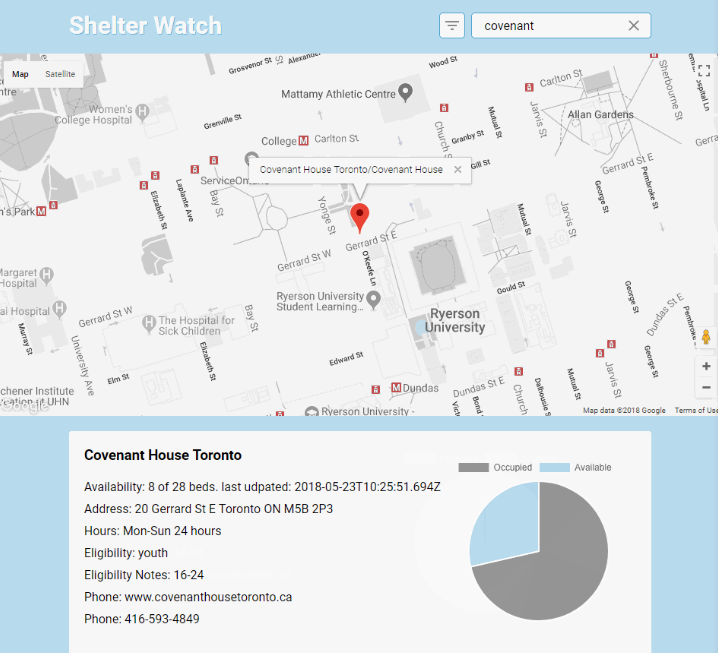

---
# Metadata
title: 'Chalmers Signal'
type: 'Electronics + Design + Web'

# Thumbnails
thumbnail: './thumbnail.svg'

# Options
path: '/chalmerssignal/'
order: 3
---

<article role="article">

**Please note: This article is about the development of Chalmers Signal V1.**

> For the more up-to-date article on the Chalmers Signal, please visit https://www.chalmerscards.com/chalmerssignal

The Chalmers Signal is an internet enabled dial designed for reporting shelter occupancy.

The Chalmers Signal is the second [Chalmers Project](https://www.chalmerscards.com), a guerilla project that aims to improve the state of homlessness in Toronto.

</article>

<article role="article">

</article>

<article role="article">

Below is an image of an experiment I ran at the [St. Felix Center](http://stfelixcentre.ca/). It's an internet button that sends me an email when the staff run out of [chalmers cards](https://zachdonsky.xyz/ChalmersCards).

It worked well too! The shelter staff told me they got a kick out of pressing a button to have me show up a few hours later.

</article>

<article role="article">

</article>

<article role="article">

> In the time I've spent studying homelessness in Toronto I've come to learn how important time is to shelter staff.

Sometimes when I would hang around a shelter reception desk I would watch the receptionist answer to three clients in person, take a phone call, and shout to another staff member back in the office, all in the space of five minutes. If the receptionist has to update a referral service on their occupancy, it often means calling the referral service directly and waiting on hold.

</article>

<article role="article">

</article>

<article role="article">

The diagram above was made as a part of the [Basecount](/basecount) project. With Basecount, we tried to consolidate shelter staff's different lines of communication for updating referral services on their capacity (phone calls to SHARC/Central Intake, SMIS, phone calls to other shelters), into one data hub.

</article>

<article role="article">

</article>

<article role="article">

We built a really neat web-app. The main interface allowed shelter staff to publish the occupancy of their shelter, and they could also send invites to other staff members to join the app under their shelter's name.

</article>

<article role="article">

<iframe loading="lazy" style="border: 1px solid rgba(0, 0, 0, 0.1);" src="https://www.figma.com/embed?embed_host=share&amp;url=https%3A%2F%2Fwww.figma.com%2Fproto%2Fdk4oQvyGyFsljLaKXSBwM9zC%2Fbasecount-wireframes%3Fnode-id%3D11%253A103%26viewport%3D664%252C1289%252C0.18000000715255737%26scaling%3Dscale-down&amp;chrome=DOCUMENTATION" allowfullscreen="" width="600" height="800"></iframe>

Basecount prototype created by [Vivian Ngai](https://www.byvivian.com/basecount/), [Joey Hua](https://joeyhua.com/), and team Basecount

</article>

<article role="article">

The difficulty was that it felt like we had given shelter staff _another_ task. Using the web-app required the user to bookmark or remember the URL, to sign up for authentication, and to learn to navigate the UI.

> Our project would help produce better data around shelter occupancy, but it really didn't make the shelter staff's lives easier.

</article>

<article role="article">

</article>

<article role="article">

While experimenting with the internet switch I left at St. Felix, I discovered much easier it was to add to someone's workflow when the thing they have to do is a simple physical interaction.

> What if broadcasting your shelter's live occupancy was as easy as turning a dial?

So I started prototyping what a _shelter occupancy broadcasting device_ might look like.

It might live behind a reception desk of a main office, like the one pictured below (modeled after the desk at St. Felix):

</article>

<article role="article">

</article>

<article role="article">

In the above illustraion, a rotating selector switch rests on a desk, connected to power. A more visible signal-light is hung from the wall. The wall mounted light is so that everyone in the office has line of sight to whatever status they're broadcasting.

</article>

<article role="article">

</article>

<article role="article">

I've been designing the device to be inexpensive, and to be assembled in a makerspace with a lasercutter and an electronics bench (e.g. [HackLab.TO](https://www.Hacklab.to) -- I am a member). I expect the material cost of each switch to be ~\$20. The design above has a graphic display for showing what occupancy it's currently broadcasting, and an rgb LED which fades to red as the dial is moved towards 100% occupancy.

</article>

<article role="article">

</article>

<article role="article">

In addition to broadcasting occupancy data, it's important to display the data in a way that's meaningful to shelter staff and clients.

One of my friends from Basecount, [Flipip Stepien](https://filipstepien.com/), developed a map interface for surfacing shelter occupancy data: [Shelter Watch](https://shelter.filipstepien.com/) (pictured above).

With the help of _Shelter Watch_, data from Chalmers Signals can be pushed to [firebase](firebase.google.com), and surface on the _Shelter Watch_ interface.

</article>
