---
# Metadata
title: "Chalmers Cards"
type: "Research + Design + Manufacturing"

# Thumbnails
thumbnail: "./thumbnail.svg"

# Options
path: "/echo1/"
order: 2
---

<article role="article">

Chalmers Cards are wooden information booklets that are designed to be given out at Toronto's emergency shelters and to folks sleeping on the streets of Toronto.

Chalmers Cards is the first project from [Chalmers](www.chalmerscards.com), which is an social venture to improve the state of homlessness in Toronto.

</article>

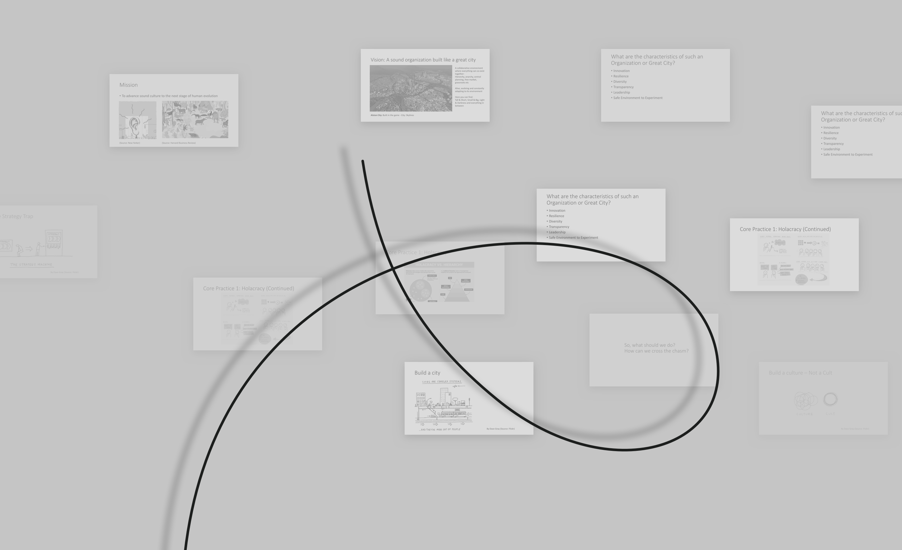

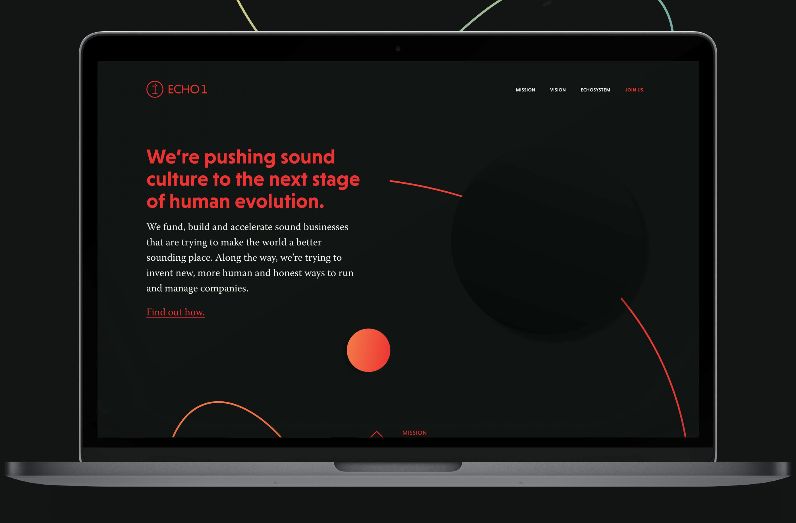

<article role="article">

> Homelessness should not exist. It's a bug in Toronto's DNA. People should be free to live how they like, but no one should ever feel they have no choice but to sleep on the street.

My goal going into thesis year at OCAD was to put a dent in Toronto's population experiencing homelessness.

My favorite design philosophy is: "Fall in love with the problem, not your solution. Solutions are just your experiments."

In this case, I identified the problem as being that **Toronto's social infrastructure was failing to scale with the increasing homeless population**. I began by trying to fall in love with the structures of Toronto's social infrastructure

</article>

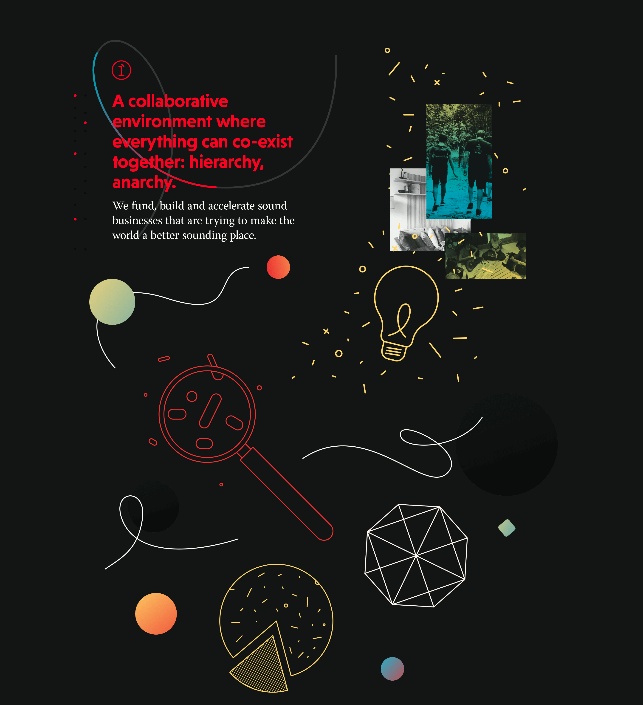
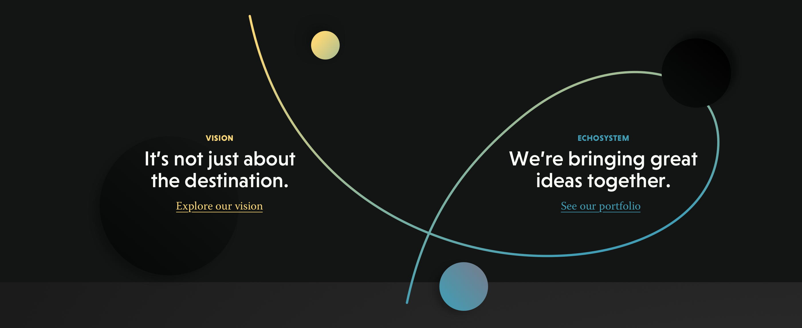

<article role="article">

Toronto's social support structures are complicated. There wasn't much public documentation available about the inner workings of Toronto's two major support administrations, SSHA (Shelter, Support, and Housing Administration) and TESS/OW (Toronto Employment Services / Ontario Works).

Most of what I was able to learn was from the front line staff who administered these services, and from people who had used the services first hand.

Even information *intended* to be public facing was difficult to find and spread wildly across the internet. Things like what resources are available, when are they available, who can access them.

M
</article>

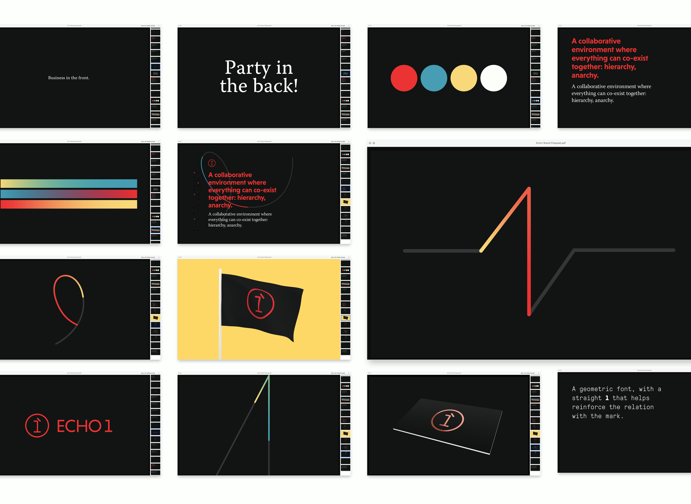
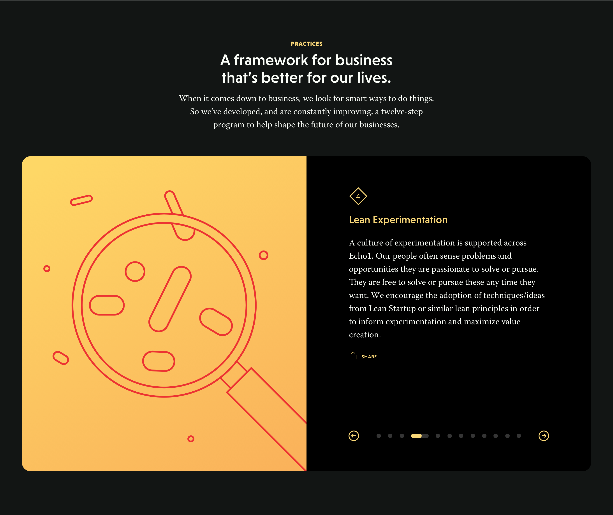

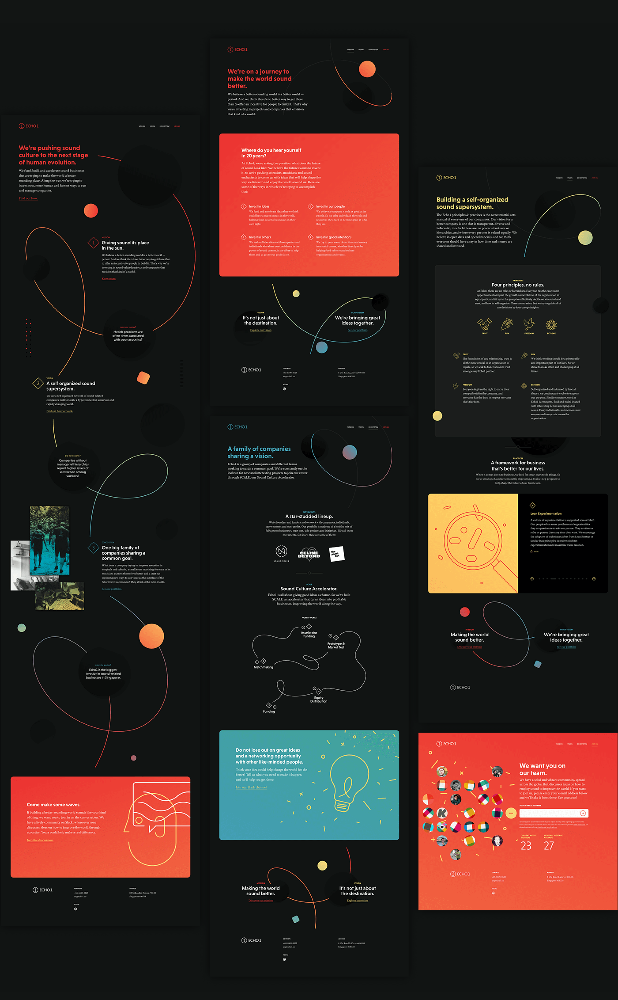
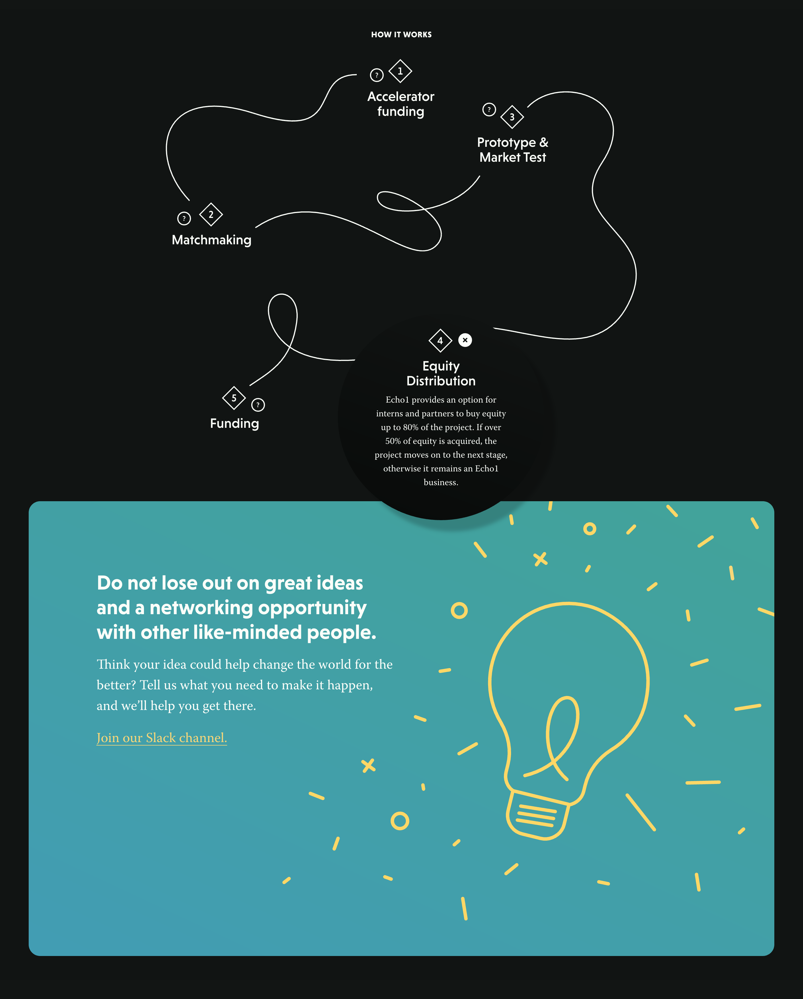
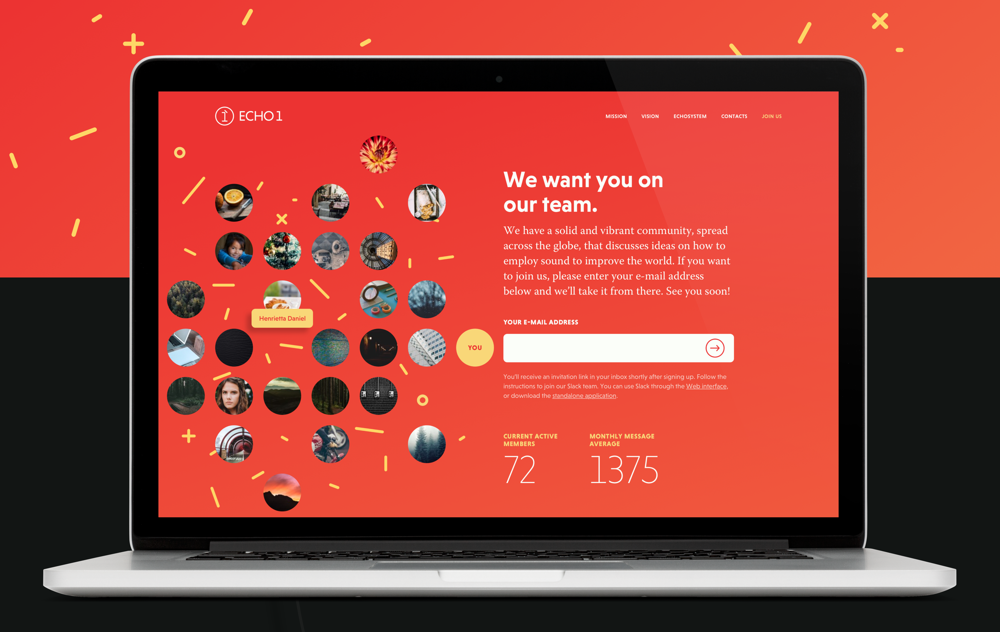
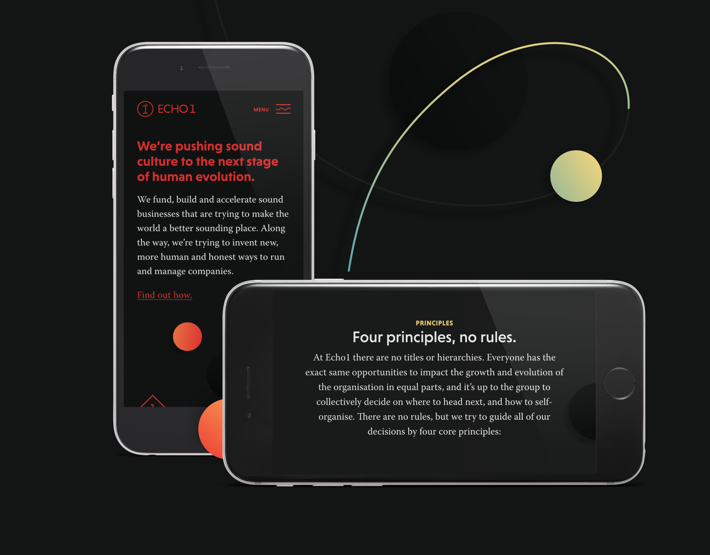
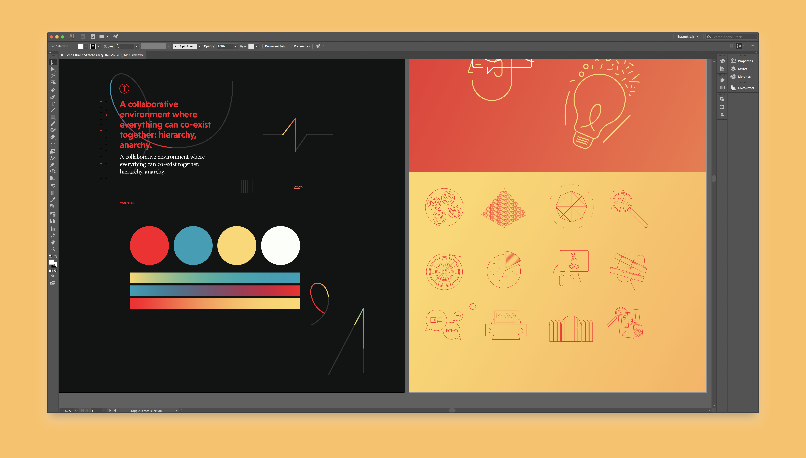

<article role="article">

> The brand and Website are, of course, just the start for Echo1.

They are now actively seeking to gather a team of investors, researchers and entrepreneurs willing to establish new businesses that help improve sound and acoustics throughout the world. They have created a Slack channel where [everyone is invited](http://echo1.co/join-us) to share their ideas with the rest of the team and ask for help (financially or otherwise) making them happen.

</article>
