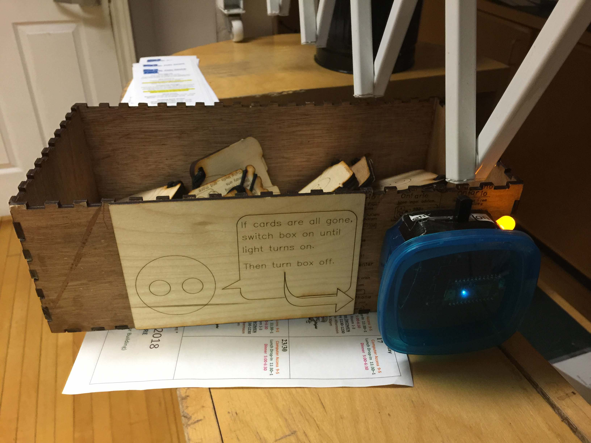
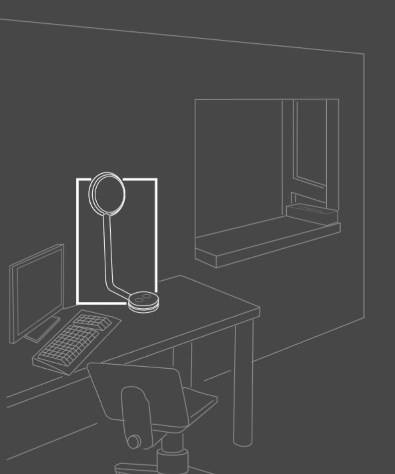

---
# Metadata
title: "Fluid Handling Robot"
type: "Electronics / Hardware Hacking"

# Thumbnails
thumbnail: "./thumbnail.svg"

# Options
path: "/fluidrobot/"
order: 4
---

<article role="article">

My friends from *Spindle Biotech* had become privey to an electronics dump that Princess Margret Hospital was going to make. They scored a lot of neat robots; amongst them a fluid handling robot.

So in the fall of 2018 I was contracted by *Spindle Biotech* to help them get the fluid handling robot up and running.

Since they got it from a dump, they didn't get any software to control it. Our plan was to completely replace the control board with an open source one, and run the robot with open source firmware and hardware.

For a control board we used a RAMPS board with an Arduino Mega, and a custom circuit board for the endstop and stepper cables to terminate into.

</article>

<article role="article">

It was a short project. From research to the prototype it only took about 12 hours.

I had a great time playing with the ESP8266, making them into a simple web server and client.

</article>

