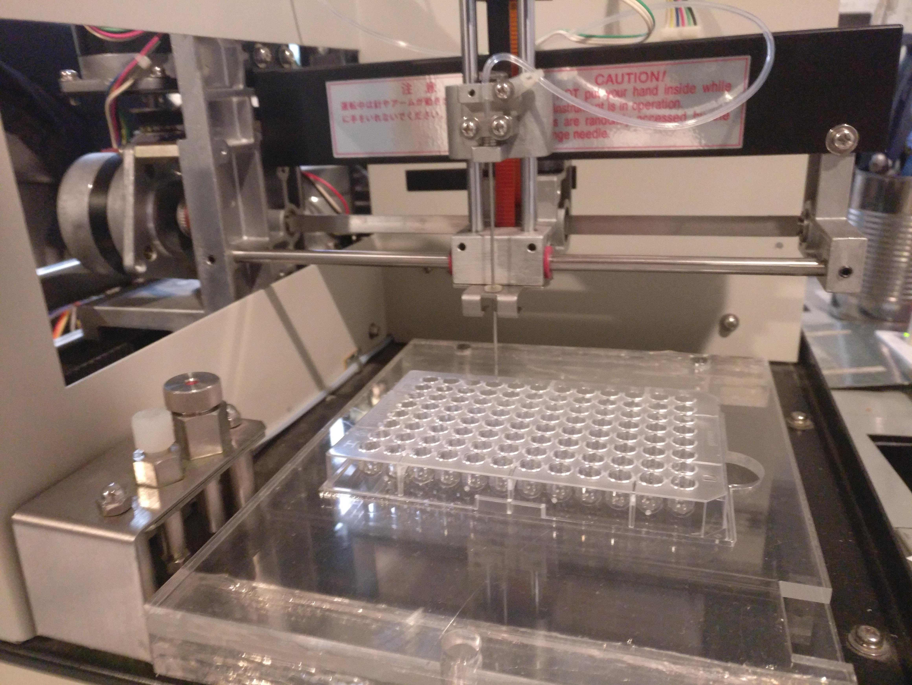

---
# Metadata
title: 'Fluid Handling Robot'
type: 'Electronics / Hardware Hacking'

# Thumbnails
thumbnail: './thumbnail.svg'

# Options
path: '/fluidrobot/'
order: 5
---

<article role="article">

My friends from _Spindle Biotech_ had become privey to an electronics dump that Princess Margret Hospital was going to make. They scored a lot of neat robots; amongst them a fluid handling robot.

In the fall of 2018 I was contracted by _Spindle Biotech_ to help them get the fluid handling robot up and running.

</article>

<article role="article">

</article>

<article role="article">

Since they got it from a dump, they didn't get any software to control it. Our plan was to completely replace the control board with an open source one, and run the robot with open source firmware and hardware. The machine was also missing a mount for a vial tray.

<article role="article">

</article>

For a control board we used a RAMPS board with an Arduino Mega, and a custom circuit board for the endstop and stepper cables to terminate into. I then laser cut a simple mount for a vial tray that Spindle Biotech provided me with.

We loaded Marlin onto the Arduino and were able to get the needle moving!

</article>

<article role="article">

</article>

<article role="article">

</article>

<article role="article">

</article>
