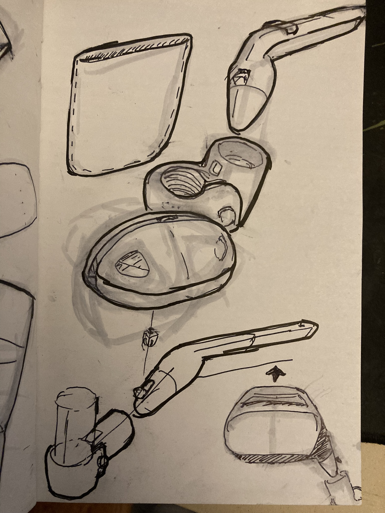

---
# Metadata
title: 'Kneepack'
type: 'Product Design'

# Thumbnails
thumbnail: './thumbnail.svg'

# Options
path: '/kneepack/'
order: 5
---

<article role="article">

Back in 2016 I put out a message on the a facebook arthritis group. The message explained that I was an industrial design student, and that I'd be willing to help design and prototype any idea anyone had, so long as they messaged me and were willing to meetup.

A couple weeks after posting the message I got a response from a lady who explained her idea for a wheelchair knapsack. She called it a _kneepack_.

</article>

<article role="article">

</article>

<article role="article">

Soon after I was able to meet up with her and her husband at OCAD. We spent the afternoon spitballing ideas and building quick prototypes.

</article>

<article role="article">

</article>

<article role="article">

</article>

<article role="article">

</article>

<article role="article">

This concept has not yet been realized. But its something I'd like to revisit in the future! I still find myself sketching ideas for this product. The photo below is a of a drawing from a few days ago! (Feb 13 2022)

</article>

<article role="article">

</article>

<article role="article">

Sewing is difficult, but facinating and inspiring. Work on this project inspired me to start repairing my own soft products, like a patch I applied my backpack! I look forward to when I'm able to return to this concept with my new sewing skills.

</article>
