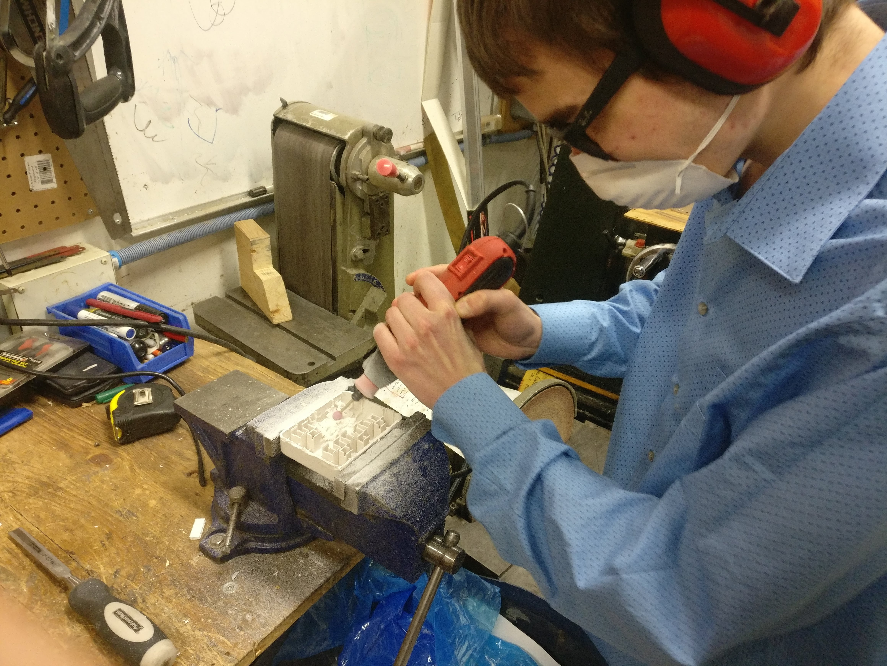
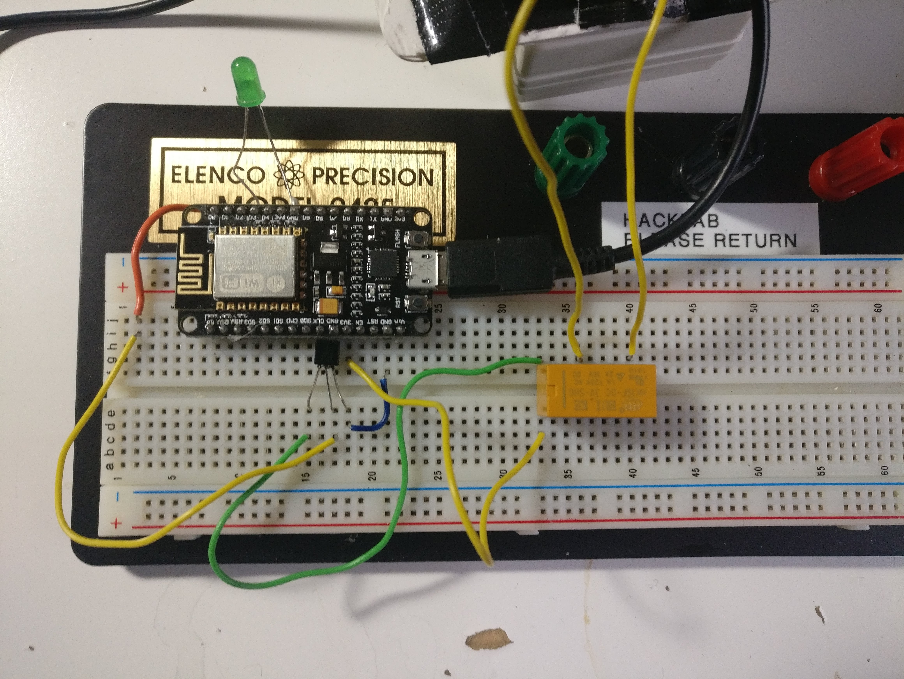
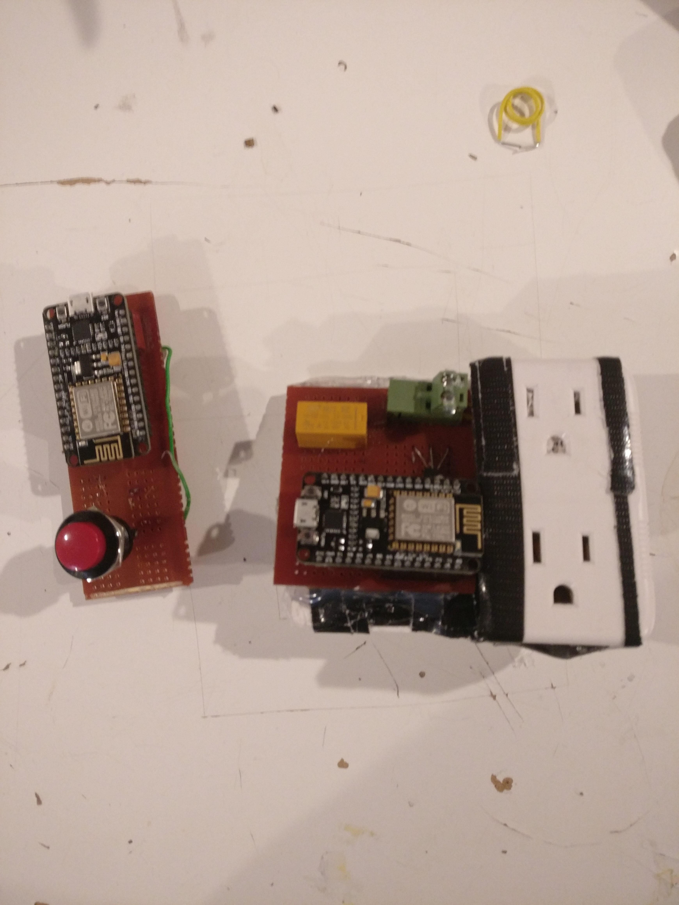

---
# Metadata
title: "Wireless Mains Switch"
type: "Electronics"

# Thumbnails
thumbnail: "./thumbnail.svg"

# Options
path: "/mainsswitch/"
order: 3
---

<article role="article">

In late 2018 I was contracted by *Tech Tap* to put together a button that could wirelessly control a mains power outlet.

*Tech Tap* planned to what I made to retrofit grocery store aisle lights to have them controlled from a Raspberry Pi.

</article>

<article role="article">

It was a short project. From research to the prototype it only took about 12 hours.

</article>

<article role="article">
I had a great time playing with the ESP8266, making them into a simple web server and client.

</article>

