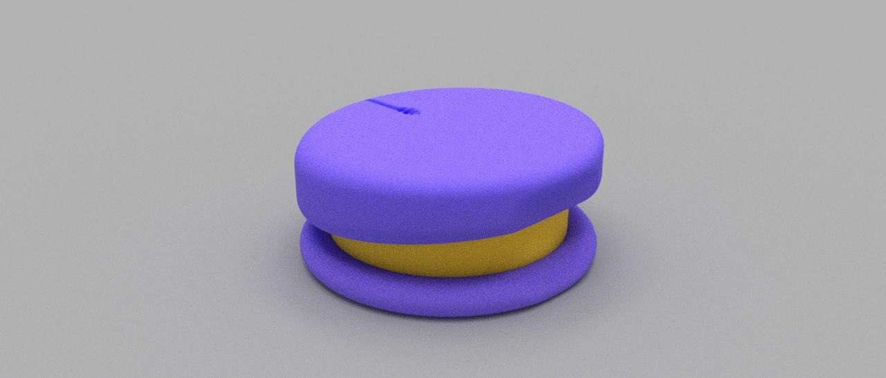
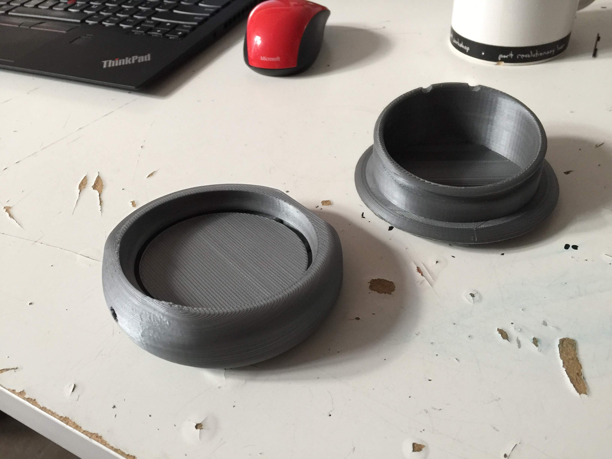

---
# Metadata
title: "Wax Container"
type: "CAD + Product Design"

# Thumbnails
thumbnail: "./thumbnail.svg"

# Options
path: "/waxcontainer/"
order: 4
---

<article role="article">

On summer afternoon in 2018, a few friends and I were joking around about the soon to be boom in the marijuana market. Cannibis was going to be legalized for recreational use in the fall, so we figured there would be an increased demand for business that supported the cannibis market.

One of the ideas that we toyed with was consumer dab containers. *'Dabs'* are a form of concentrated THC. Because they're so sticky, they need to be stored in a non-stick material, like silicone.

Seeing this as an opportunity to learn about casting silicone, maybe try our hands at some injection molding, and also design something neat, we took to the drawing board!

</article>

<article role="article">

As of my writing this only hacked on the project for about a month in our spare time. So we only really have one working prototype design.

Here's a rendering of our latest design:

</article>

<article role="article">

A few days ago we printed it up at [Hacklab.to](Hacklab.to). We're going to try and make a mold out of the model, and then try to cast a first silicone prototype in it.

</article>

